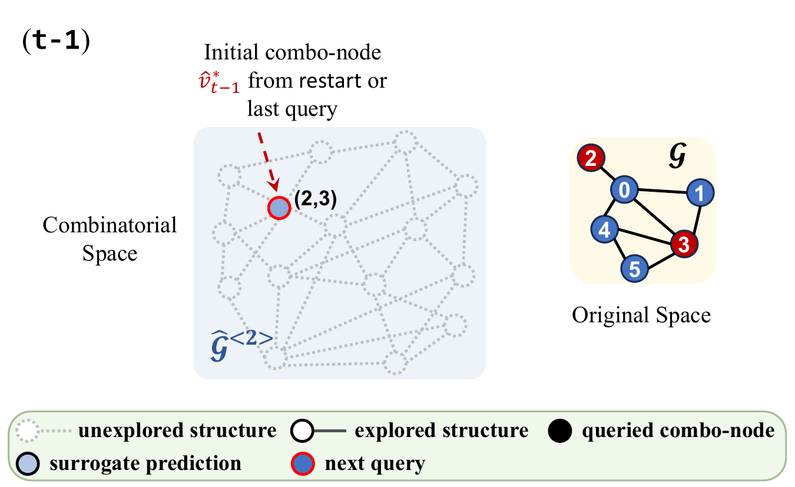
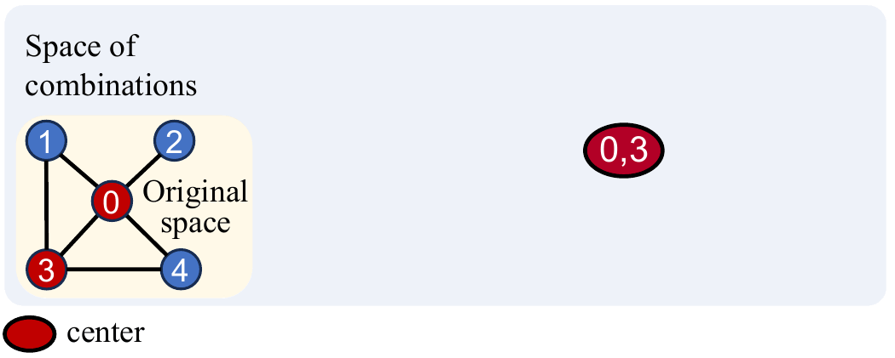

# Bayesian Optimization of Functions over Node Subsets in Graphs [NeurIPS2024]
This is the repo for GraphComBO, a Bayesian optimization tool for black-box and expensive functions defined over node subsets in graphs, 
where the goal is to find the optimal subset within a limited number of queries (evaluations of the underlying function). 

### Search Animation 
<div align="center">
  
</div>

### Recursive Combo-subgraph Sampling - Demo

<div align="center">
  
</div>

## Installation
### 1. Create a virtual environment for GraphComBO
```
conda create -n GraphComBO
conda activate GraphComBO
```

### 2. Install Common Packages (skip if satisfied)
The following common packages are assumed to be installed beforehand:
```
numpy pandas matplotlib scipy networkx math functools itertools future multiprocessing
```
Note that [scikit-learn](https://scikit-learn.org/stable/install) and [PyTorch](https://pytorch.org/get-started/locally/) are also required, which can be installed in the links.

### 3. Install BoTorch
We use [BoTorch](https://botorch.org/) and [GPyTorch](https://gpytorch.ai/) to implement our BO algorithm.

To install BoTorch with conda:
```
conda install botorch -c pytorch -c gpytorch -c conda-forge
```
or alternatively install with pip
```
pip install botorch
```

### 4. Install other Packages for Experiments
Lastly, the following packages are used for different experiment setups.
```
pip install torch_geometric
pip install ndlib
pip install osmnx
pip install ogb
```

## Run
Use the following line in a bash shell to test the algorithm with the default config from `configurations/testing.yaml`,
and enable `--plot_result True` to visualize the result.
```bash
python main.py --plot_result True
```
To reproduce the experiment results, use the following code with pre-specified configurations:
```bash
python main.py --problem BA
python main.py --problem WS
python main.py --problem GRID
python main.py --problem SBM
python main.py --problem Transitivity
python main.py --problem GNN_attack
python main.py --problem Coauthor_IC
python main.py --problem SIR
python main.py --problem Patient_Zero
```
